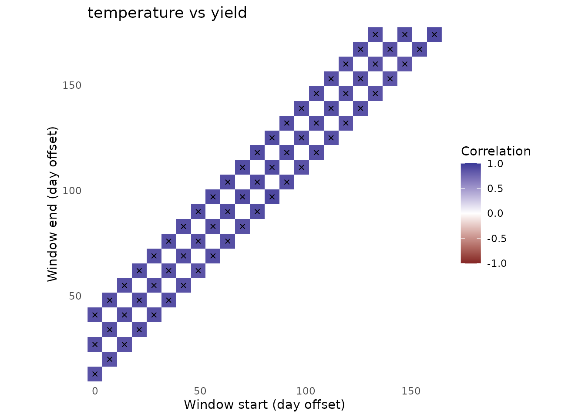

# Getting started with envwindowr

``` r

library(envwindowr)
```

``` r

dat <- simulate_env_window_data(n_environments = 24)
fit <- scan_env_windows(
  dat$weather, dat$traits, dat$periods,
  weather_vars = c("temperature", "rainfall"),
  trait_vars = c("yield", "quality"),
  window_sizes = c(14, 28, 42), step = 7,
  summaries = c(temperature = "mean", rainfall = "sum"),
  min_pairs = 10
)
```

    ## Analyzing window 1 of 66...

    ## Analyzing window 25 of 66...

    ## Analyzing window 50 of 66...

    ## Analyzing window 66 of 66...

``` r

rank_env_windows(fit, n = 3)
```

    ## # A tibble: 12 × 17
    ##     rank window_id start_offset end_offset window_days environmental_variable
    ##    <int>     <int>        <int>      <int>       <int> <chr>                 
    ##  1     1        42          119        146          28 rainfall              
    ##  2     2         3           14         27          14 rainfall              
    ##  3     3        63          112        153          42 rainfall              
    ##  4     1        66          133        174          42 rainfall              
    ##  5     2        24          161        174          14 rainfall              
    ##  6     3        65          126        167          42 rainfall              
    ##  7     1        22          147        160          14 temperature           
    ##  8     2        16          105        118          14 temperature           
    ##  9     3        28           21         48          28 temperature           
    ## 10     1        13           84         97          14 temperature           
    ## 11     2        24          161        174          14 temperature           
    ## 12     3        35           70         97          28 temperature           
    ## # ℹ 11 more variables: trait <chr>, mean_coverage <dbl>,
    ## #   min_coverage_observed <dbl>, correlation <dbl>, p_value <dbl>,
    ## #   n_pairs <int>, environmental_sd <dbl>, trait_sd <dbl>, status <chr>,
    ## #   p_adjusted <dbl>, absolute_correlation <dbl>

``` r

plot_window_heatmap(fit, "temperature", "yield")
```


