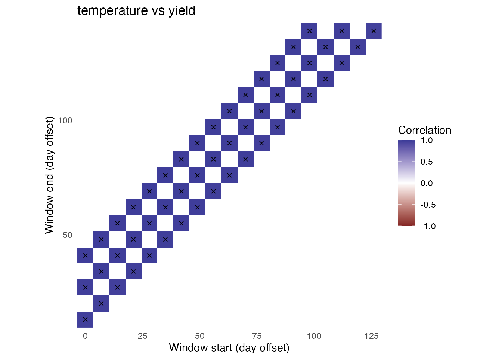

# Getting started with envwindowr

``` r
library(envwindowr)
```

This short example uses simulated data. For CSV input, weather queries,
and a complete real-data workflow, see
[`vignette("real-data-workflow")`](https://pauliben.github.io/envwindowr/articles/real-data-workflow.md).

``` r
dat <- simulate_env_window_data(
  n_environments = 24,
  n_days = 140,
  n_genotypes = 8,
  signal_start = 45,
  signal_end = 75
)

head(dat$phenotypes)
```

    ## # A tibble: 6 × 4
    ##   environment_id genotype_id yield quality
    ##   <chr>          <chr>       <dbl>   <dbl>
    ## 1 E01            G001         5.75    5.84
    ## 2 E01            G002         6.17    6.57
    ## 3 E01            G003         6.41    8.35
    ## 4 E01            G004         3.92    7.53
    ## 5 E01            G005         5.17    5.38
    ## 6 E01            G006         5.47    7.44

``` r
head(dat$environments)
```

    ## # A tibble: 6 × 8
    ##   environment_id latitude longitude season_start season_end altitude_m
    ##   <chr>             <dbl>     <dbl> <date>       <date>          <dbl>
    ## 1 E01                29.2     -80.7 2022-10-13   2023-03-01        9.4
    ## 2 E02                29.1     -82.7 2021-11-09   2022-03-28       53.2
    ## 3 E03                30.2     -80.4 2020-05-08   2020-09-24       70.7
    ## 4 E04                27.1     -82.0 2022-07-18   2022-12-04       63.4
    ## 5 E05                28.9     -80.5 2021-04-15   2021-09-01       64.8
    ## 6 E06                29.9     -82.0 2020-10-25   2021-03-13       39.1
    ## # ℹ 2 more variables: start_date <date>, end_date <date>

A **window size** is the number of consecutive weather days summarized.
A **step size** is how many days the window moves between tests. Thus, a
28-day window with a 7-day step tests days 0-27, 7-34, 14-41, and so
forth.

``` r
fit <- scan_env_windows(
  weather = dat$weather,
  traits = dat$phenotypes,
  periods = dat$environments,
  weather_vars = c("temperature", "rainfall"),
  trait_vars = c("yield", "quality"),
  window_sizes = c(14, 28, 42),
  step = 7,
  summaries = c(temperature = "mean", rainfall = "sum"),
  min_pairs = 10,
  quiet = TRUE
)

fit
```

    ## Environmental-window scan
    ##   Windows: 51 
    ##   Environments: 24 
    ##   Weather variables: temperature, rainfall 
    ##   Traits: yield, quality 
    ##   Window size(s): 14, 28, 42 days
    ##   Step: 7 days
    ##   Successful tests: 204 of 204

``` r
rank_env_windows(fit, n = 3)
```

    ## # A tibble: 12 × 17
    ##     rank window_id start_offset end_offset window_days environmental_variable
    ##    <int>     <int>        <int>      <int>       <int> <chr>                 
    ##  1     1        36          112        139          28 rainfall              
    ##  2     2        19          126        139          14 rainfall              
    ##  3     3        51           98        139          42 rainfall              
    ##  4     1        36          112        139          28 rainfall              
    ##  5     2        19          126        139          14 rainfall              
    ##  6     3        51           98        139          42 rainfall              
    ##  7     1         4           21         34          14 temperature           
    ##  8     2        26           42         69          28 temperature           
    ##  9     3        41           28         69          42 temperature           
    ## 10     1        42           35         76          42 temperature           
    ## 11     2        25           35         62          28 temperature           
    ## 12     3        24           28         55          28 temperature           
    ## # ℹ 11 more variables: trait <chr>, mean_coverage <dbl>,
    ## #   min_coverage_observed <dbl>, correlation <dbl>, p_value <dbl>,
    ## #   n_pairs <int>, environmental_sd <dbl>, trait_sd <dbl>, status <chr>,
    ## #   p_adjusted <dbl>, absolute_correlation <dbl>

``` r
diagnose_env_scan(fit)
```

    ## $n_environments
    ## [1] 24
    ## 
    ## $n_windows
    ## [1] 51
    ## 
    ## $status_counts
    ## # A tibble: 1 × 2
    ##   status     n
    ##   <chr>  <int>
    ## 1 ok       204
    ## 
    ## $warnings
    ## [1] "No structural problems detected by the built-in checks."

``` r
plot_window_heatmap(fit, "temperature", "yield")
```


